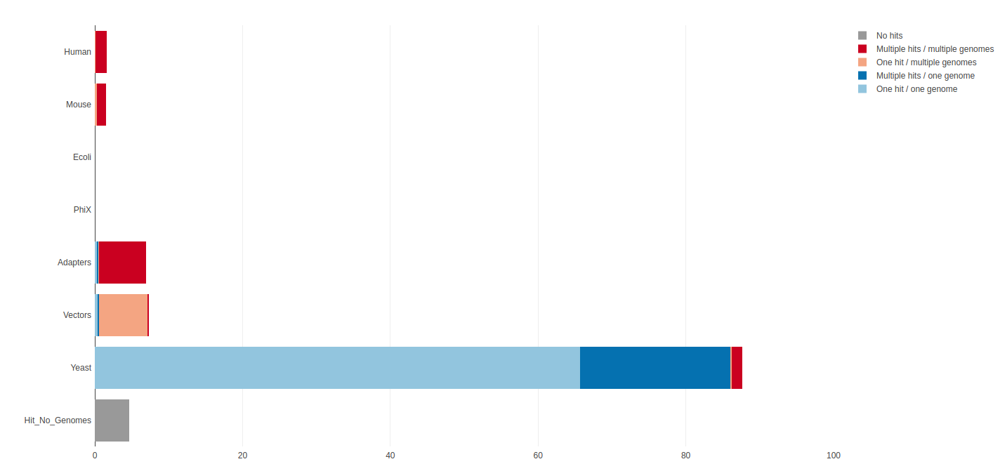
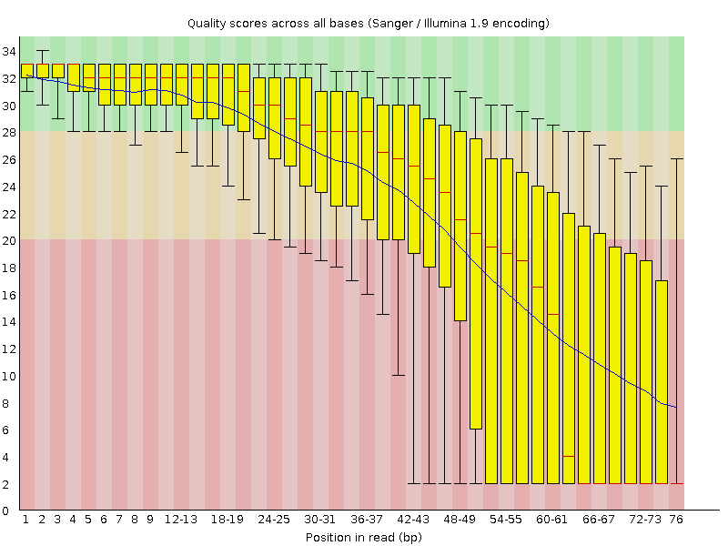
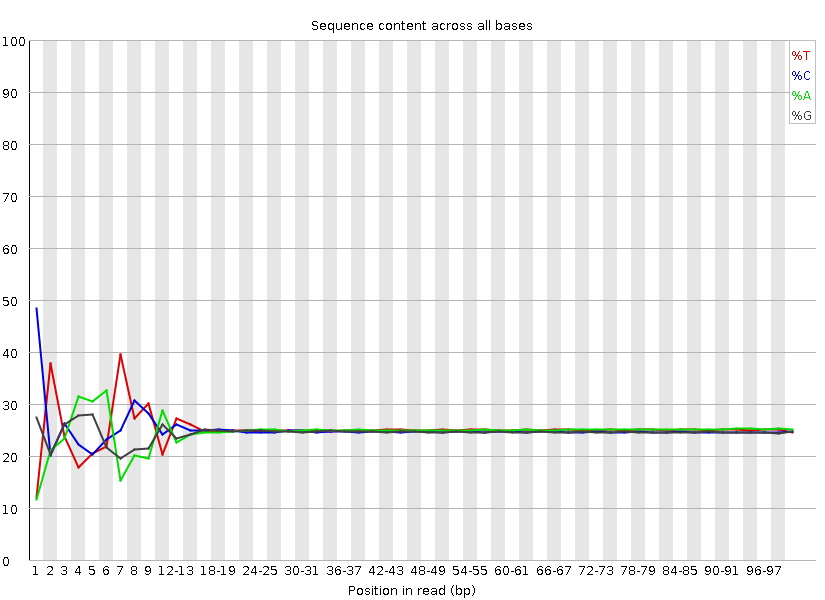
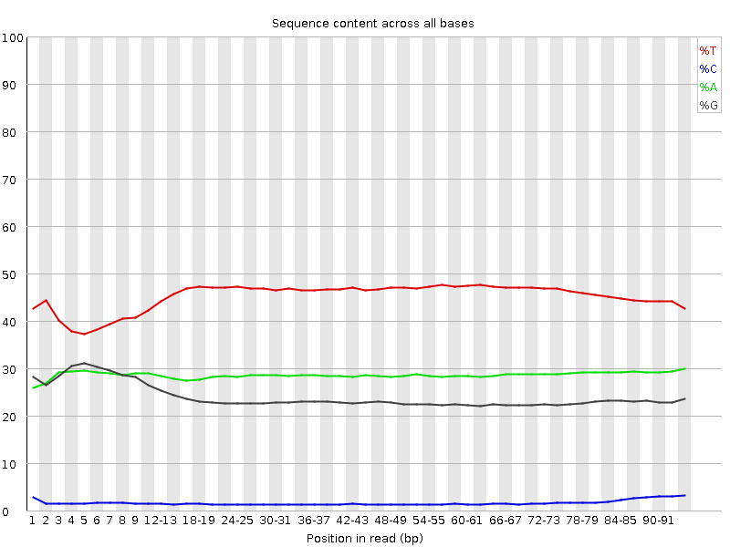
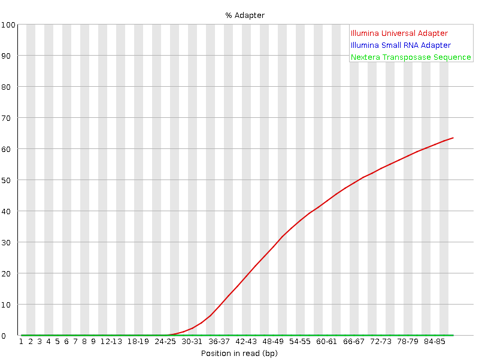

<head>
<script src="https://kit.fontawesome.com/ece750edd7.js" crossorigin="anonymous"></script>
</head>

<br>

### FastQ files

Sequencing data will typically be provided to you in fastq format (.fq or .fastq) or as a compressed gzipped fastq (.fq.gz) in order to save space. We can view a gzipped file with the zless command, let's take a look:

```bash
cd ChIP-seq_workshop/fastq # Move into the fastq directory (if not already)
zless Input_R1.fq.gz | head -n 12
```

[Fastq](https://en.wikipedia.org/wiki/FASTQ_format) files contain 4 lines per sequenced read:

* Line 1 begins with an '@' character and is followed by a sequence identifier and an optional description
* Line 2 is the raw sequence
* Line 3 begins with a '+' character and is optionally followed by the same sequence identifier
* Line 4 encodes the Phred quality score for the sequence in Line 2 as ASCII characters


<br>

### 3. Quality control

Next we want to assess the quality of our sequencing data and check for any biases and contamination. 

<br>

### FastQ screen

When running a sequencing pipeline it is useful to know that your sequencing runs contain the types of sequence they're supposed to. [FastQ Screen](http://www.bioinformatics.babraham.ac.uk/projects/fastq_screen/) allows you to set up a standard set of libraries against which all of your sequences can be searched. Your search libraries might contain the genomes of all of the organisms you work on, along with PhiX, Vectors or other contaminants commonly seen in sequencing experiments. We will run a screen of our sequences against human, mouse, rat, e.coli and s.cerevisiae (defaults):

```bash
cd .. #Move up a directory again
fastq_screen --conf /homes/genomes/tool_configs/fastq_screen/fastq_screen.conf fastq/*fq.gz --outdir fastq
# * is a wild card character
```
Once complete take a look at the output images in your browser via your public html folder. This shows that most of your reads align to the yeast genome and that no reads align uniquely to other organisms:
<!--Update pic here?-->


<br>

### FastQC

[FastQC](http://www.bioinformatics.babraham.ac.uk/projects/fastqc/) provides simple quality control checks on raw sequence data coming from high throughput sequencing pipelines. It provides a modular set of analyses which you can use to get a quick impression of whether your data has any problems of which you should be aware before proceeding.

```bash
fastqc fastq/*.fq.gz
```
FastQC will create report files for each of your datasets which we can view in the browser. We will go through each of the images during the workshop. For future reference, specific guidance on how to interpret the output of each module is provided in the [fastqc help pages](http://www.bioinformatics.babraham.ac.uk/projects/fastqc/Help/).

An example of poor quality sequencing at the end of short reads:



The software gives a *pass*, *fail* or *warning* flag for each test based on what we would expect from a regular DNA-sequencing run. It is important to realise that FastQC does not understand the origin of your data and that different datasets will have different characteristics. For instance RNA sequencing often involves the use of **random hexamer primers** that are [not as random as you might expect](https://sequencing.qcfail.com/articles/positional-sequence-bias-in-random-primed-libraries/). The profile below in the first ~15 bases is perfectly normal for these samples but will be flagged as an error by FastQC:



Bisulfite treatment (used to investigate DNA methylation) converts most Cs in the genome to Ts, as we can see below. FastQC will not be happy with this profile, the point is, understand what you have sequenced and what you expect to see rather than blindly trusting the FastQC flag system!



Visit the [QCFail](https://sequencing.qcfail.com/author/simon/) website for more examples and advice on quality control for NGS datasets.

<br>

### MultiQC

We can view summaries of multiple reports at once by using [multiqc](http://multiqc.info/):

```bash
multiqc -o fastq fastq
```

MultiQC searches for report files in a directory and compiles them into a single report. Open the multiqc report via a web browser to see how the raw datasets compare. Here we have the output of FastQ_screen and FastQC, but MultiQC works with the outputs of many tools other tools which we'll see later.

If we look at the *adapter content* and *over represented sequences* sections we can see a small amount of contamination particularly in the second replicates.

<br>

### 4. Shell scripts, pipelining and parallelisation

Up until now we have run command line tools on each one of our datasets in serial, this means they run one after the other. In this tutorial we only have a few small datasets and the tools run relatively quickly, but this approach won't scale well to multiple large datasets. A more efficient approach is to create a **script** that will run all of our datasets in **parallel**.

<br>

### parallel

Unix has a program called **parallel** which allows you to run tools on multiple datasets at the same time. The following command would list all of your gzipped fastq files and pipe them into parallel. 

```bash
ls fastq/*fq.gz | parallel -j 4 fastqc {} &
ps f
```
* *ls* lists files ending with .fq.gz in your fastq directory and pipes the names in to parallel
* The parallel *-j* flag stands for *juggle* and tells parallel to run 4 processes at the same time. 
* In this case we are running fastqc and the *{}* is a place holder for the filenames we are piping in. 
* The *&* character runs these jobs in the background so we can continue to use the terminal.
* *ps* is the *process status* tool which shows jobs running in the current session, we should see 4 instances of fastqc running.

<br>

### Shell scripts

Putting all of your commands into a script is good practice for keeping track of your analyses and for reproducibility. We want to write scripts so they can be used again on different datasets and avoid *hardcoding* the names of files.

First, let's create a file that lists our sample names so we can feed this into our pipeline. We could just type this manually or use a bit of text processing like the code below, here fastq files are 'piped' into parallel as above but we use regular expression within 'sed' to remove the name ending, this can now be used to name all files.

```bash
ls fastq/*fq.gz | parallel basename | sed s/.fq.gz// > samples.txt
```

Now let's create our pipeline script. We'll start by creating and opening a new file called **pipeline.sh**. The .sh stands for shell which is essentially just a name for the command line environment.

```bash
emacs -nw pipeline.sh
```
**Emacs** is a Unix text editor and the -nw flag opens a new window for editing. Here we are going to paste all of the commands we have used so far (click the mouse wheel to paste in the terminal):

~~~
##PREPARATION

##Create a web directory to view output                         
ln -s $PWD ~/public_html/
##Create a folder for fastq files
mkdir fastq
##Copy the raw data to the fastq folder
cp /homes/library/training/ChIP-seq_workshop/data/*fq.gz fastq/.

##QC

##FastQ Screen
fastq_screen --conf /homes/genomes/tool_configs/fastq_screen/fastq_screen.conf fastq/*fq.gz --outdir fastq

##FastQC
fastqc fastq/*.fq.gz
##Multi QC
multiqc -o fastq fastq

##PREPROCESSING 
~~~

The **#** symbol indicates a comment line and anything preceeded by a # will not be run by the command line. It is good practice to comment your code.

<br>

###Challenge
<div class="challenge">
<h2><i class="fas fa-pencil-alt"></i> Challenge:</h2>
See if you can adapt the QC portion of the script to use parallel. 

**Hint:** `cat samples.txt` will print the names of the samples.
<details>
<summary>
Solution
</summary>
<div class="solution">
<h2><i class="far fa-eye"></i></h2>
`cat samples.txt | parallel -j 4 fastq_screen --conf /homes/genomes/tool_configs/fastq_screen/fastq_screen.conf fastq/{}.fq.gz  --outdir fastq`

`cat samples.txt | parallel -j 4 fastqc fastq/{}.fq.gz`
</div>
</details>
</div>
<br>

To save and exit the file press **ctrl-x**, followed by **ctrl-c** and then **y** to save.

Let's move on with our ChIP-seq analysis. Everytime we run a tool that creates new output we should add it to our pipeline.sh file. We will learn how to run this script and the full analysis in one go later on.

Although shell scripts save all of your commands they do not necessarily track the versions of software that you use or the current state of your environment and other tool dependencies. More advanced methods of *pipelining* and *containerisation* are recommended for fully reproducible analysis and sustainable programming.

<br>

### 5. Pre-processing: Quality trimming and adapter removal

From the FastQC report we can see that the overall quality of our sequencing is good, however it is good practice to perform some pre-processing and filtering of reads. Poor quality sequencing can make a read less alignable so it is good practice to **quality trim** the ends of reads until we get to the high quality portion. Trimming is not always neccessary as some mapping programs will trim the reads for you or perform **soft clipping** where only part of a read is required to align but studies have shown that pre-processing generally improves alignment rate if done correctly. 

Sequencing libraries are normally constructed by ligating adapters to fragments of DNA or RNA. If your read length is longer than your fragment then [sequenced reads will contain the adapter sequence](https://sequencing.qcfail.com/articles/read-through-adapters-can-appear-at-the-ends-of-sequencing-reads/). **Adapter removal** is also a necessary consideration for your QC workflow, especially if adapters are detected by FastQC.

An example of adapter contamination at the end of reads:


Once reads have been trimmed they will vary in length. You may want to **filter** out reads that are now too short to be uniquely mapped. Normally a cutoff of 20-30bp is standard.

Trim with caution and think about the consequences of having different length reads later on in your pipeline. In fact, it is possible to overtrim your reads and aggressively remove valid data.


<br>

### Cutadapt

[Cutadapt](http://cutadapt.readthedocs.org/en/stable/index.html) finds and removes unwanted sequences from your high-throughput sequencing reads. Cutadapt can perform quality trimming, adapter removal and read filtering as well as many other operations to prepare your reads for optimal alignment. We will run cutadapt with the following parameters:

* -a : The sequence of the adapter to remove
* -q : Trim reads from the 3' end with the given quality threshold (Phred score)
* --minimum-length : Filter out reads below this length

We will also run FastQC on the trimmed dataset.

<div class="blue">
```bash
cat samples.txt | parallel -j 4 "cutadapt -a AGATCGGAAGAG -q 20 --minimum-length 36 -o fastq/{}.trim.fq.gz fastq/{}.fq.gz > fastq/{}.trim.cutadapt_report.txt"

cat samples.txt | parallel -j 4 fastqc fastq/{}.trim.fq.gz
```
</div>

To view a cutadapt report:
```bash
less fastq/Reb1_R1.trim.cutadapt_report.txt
```

Let's compare the fastqc reports using [multiqc](http://multiqc.info/). As you have run it already you need to use the force (-f) flag to get it to overwrite the current report.

<div class="blue">
```bash
multiqc -f -o fastq fastq
```
</div>

Open the multiqc report via a web browser to see how the raw and trimmed datasets compare.

Remember to add the cutadapt, fastqc and multiqc steps to your **pipeline.sh** file.


<br>

### Other QC software worth investigating 

* [Trimmomatic](http://www.usadellab.org/cms/?page=trimmomatic) is very good and runs with Java
* [Trim Galore!](http://www.bioinformatics.babraham.ac.uk/projects/trim_galore/)

<div class="key-points">
<h2><i class="fas fa-thumbtack"></i>Key Aims:</h2>
##
 * Check for contaminants
 * Asses sequence quality
 * Understand scripting
 * Trim your data
</div>
<br>
