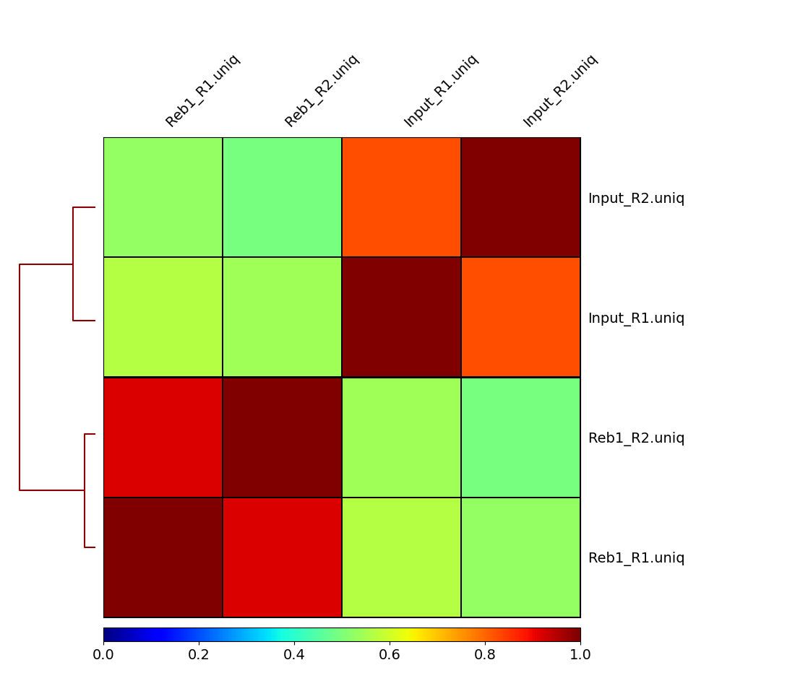
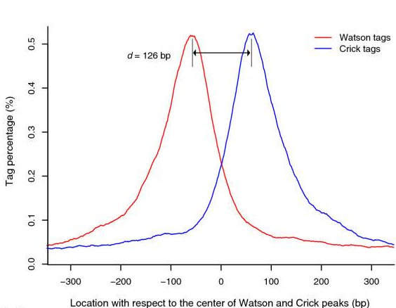
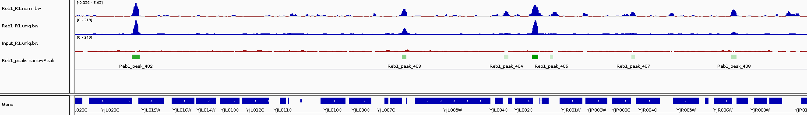

<head>
<script src="https://kit.fontawesome.com/ece750edd7.js" crossorigin="anonymous"></script>
</head>

<br>

### 10. Assessing ChIP quality

After we have mapped and filtered the reads it is time to make some inferences about how good the underlying data is.

<br>

### More Scripting

First we want to create a new script for the analysis part of the exercise and we can save all new commands in here. We'll start by creating and opening a new file called **analysis.sh**. The .sh stands for shell which is essentially just a name for the command line environment. Here we won't be using parallel.

```bash
emacs -nw analysis.sh
```
**Emacs** is a Unix text editor and the -nw flag opens a new window for editing. Here we are going to paste all of the commands as we go (click the mouse wheel to paste in the terminal):

The **#** symbol indicates a comment line and anything proceeded by a # will not be run by the command line. It is good practice to comment your code. Try adding some comments.

To save and exit the file press **ctrl-x**, followed by **ctrl-c** and then **y** to save.

Although shell scripts save all of your commands they do not necessarily track the versions of software that you use or the current state of your environment and other tool dependencies. More advanced methods of *pipelining* and *containerisation* are recommended for fully reproducible analysis and sustainable programming.

<br>

### Correlation amongst samples

In our experiment there are two replicates, each containing treatment and input (control) datasets. The first thing we can check is if the samples are correlated (in other words if treatment and control samples across the two replicates contain this same kind of signal). To do this we first generate a read count matrix using [deepTools multiBamSummary](https://deeptools.readthedocs.io/en/develop/content/tools/multiBamSummary.html). It will take around 5 minutes to complete so it's best to set it running and read on. 

<div class="blue">
```bash
multiBamSummary bins -b bwa_out/*/*uniq.bam -bs 10000 -o cov.matrix -e 200 --smartLabels
```
</div>

This tool splits the genome into bins of fixed size (10,000 bp in our example) and computes the number of reads falling within each bin. The output is in a compressed unreadable format but here is a fragment of the data produced:

```
#'chr' 'start' 'end'  'Reb1_R1'  'Input_R1'  'Input_R1'  'Reb1_R2'
chrVI      0     10000   19.0         41.0         3.0        6.0
chrVI   10000    20000   29.0         30.0        13.0        5.0
chrVI   20000    30000    0.0          0.0         0.0        0.0
chrVI   30000    40000    0.0          2.0         0.0        0.0
chrVI   40000    50000 7447.0        139.0         7.0     2645.0
```

We can then feed this matrix into **DeepTools plotCorrelation** to generate a heat map.

<div class="blue">
```bash
plotCorrelation -in cov.matrix -p heatmap -c spearman -o spearman_cor.png
```
</div>



Here we can see that treatments (Reb1) and controls (input) correlate well with each other, while correlation between treatments and controls is weak. This is a good sign implying that there is reproducible signal on our data.


<br>

### Assessing signal strength

How do we tell if we have signal coming from ChIP enrichment? One way of doing this is Signal Extraction Scaling (SES) proposed by [Diaz:2012](https://www.degruyter.com/downloadpdf/j/sagmb.2012.11.issue-3/1544-6115.1750/1544-6115.1750.pdf). SES works as follows: Suppose we have two datasets: ChIP and Input DNA. We divide the genome into N non-overlapping windows and for each window we compute the number of reads in each sample. We then sort the windows by the number of reads in 1 sample and plot the cumulative fraction of reads. We expect Input samples to show approximately equal distribution of reads across all windows and thus give a flat line, whereas ChIP samples with very defined enrichments should have a high proportion of reads in a small number of bins. [DeepTools](http://deeptools.readthedocs.io/en/latest/) provides a nice explanation of how the success of a ChIP experiment can be judged based on SES (also called fingerprint) plots:


We can apply this to our own data with **DeepTools plotFingerprint**:

<div class="blue">
```bash
plotFingerprint -b bwa_out/*/*uniq.bam -e 200 --smartLabels -o fingerprint.png &
```
</div>

The fingerprint tool can take a long time to run so we will run in the background (&) and continue with the tutorial. However, You should get a plot that looks like the one below where approximately 30% of the ChIP reads are concentrated in to a small number of bins.


<br>

### 11. Summarizing ChIP signal enrichment across genes

How many genes contain upstream regions enriched in Reb1 ChIP-seq reads? This is often represented as a heatmap, here is an example of histone modification ChIP-seq data from the Deeptools documentation:


First we want to create normalised datasets of ChIP signal vs Input for our two replicates. This is done using **DeepTools bamCompare** and gives us a bigWig file of normalised log2 ratios.

<div class="blue">
```bash
bamCompare -b1 bwa_out/Reb1_R1/Reb1_R1.uniq.bam -b2 bwa_out/Input_R1/Input_R1.uniq.bam -o Reb1_R1.norm.bw -e 200 --operation log2 --normalizeUsing BPM --scaleFactorsMethod None &
bamCompare -b1 bwa_out/Reb1_R2/Reb1_R2.uniq.bam -b2 bwa_out/Input_R2/Input_R2.uniq.bam -o Reb1_R2.norm.bw -e 200 --operation log2 --normalizeUsing BPM --scaleFactorsMethod None &
```
</div>

The bamCompare tool should take ~5 minutes to complete so you can move on to the next step. These bigWig files can also be viewed in IGV so go ahead and link them to the visualisation folder:

<div class="blue">
```bash
ln -s $PWD/*norm.bw visualisation
```
</div>

Because we want to plot enrichment around genes we need the gene annotations. These are already downloaded in the ~genomes folder so let's link them to our current directory.

<div class="blue">
```bash
cp /homes/genomes/s.cerevisiae/sacCer3/annotation/UCSC_sgdGene.bed .
```
</div>

Take a look at this file:
```bash
head UCSC_sgdGene.bed
```

These gene annotations are downloaded from the UCSC website in bed12 format: The co-ordinates are in columns 1-3, the gene name in column 4 and the strand in column 6.

To prepare data necessary for drawing the heatmap we will use [deepTools computeMatrix](https://deeptools.readthedocs.io/en/develop/content/tools/computeMatrix.html). Here we supply our normalised datasets as (S)core files along with the yeast genes from UCSC as the (R)egions to plot. We are going to compute reads around the TSS in 100b bins, with a 2kb flanking region either side. 

<div class="blue">
```bash
computeMatrix reference-point -R UCSC_sgdGene.bed -S Reb1_R1.norm.bw Reb1_R2.norm.bw -o TSS.matrix --referencePoint TSS --upstream 2000 --downstream 2000 -bs 100 --smartLabels
```
</div>

The warning "Skipping Q0010, due to being absent in the computeMatrix output." refers to mitochondrial genes and chrM has been exlcuded.

Finally, we can visualize the heatmap by using the **DeepTools plotHeatmap** tool:

<div class="blue">
```bash
plotHeatmap -m TSS.matrix -o TSS.heatmap.png 
```
</div>

The resulting image shows that a significant fraction of genes have peaks of Reb1 enrichment within their upstream regions:

<details>
<summary>
Reveal Plot
</summary>
<div class="solution">
<h2><i class="far fa-eye"></i></h2>


</div>
</details> 


It is worth taking a look at the [documentation](http://deeptools.readthedocs.io/en/latest/content/list_of_tools.html) for the deepTools package in your own time to understand the range of tools and how different parameters affect your data and the different plots you can make.

<br>

### 12. Calling peaks

While the peaks we have found in the genome browser are pretty clear and consistent across the two replicates, looking at the entire genome in the browser is hardly an efficient way to identify all peaks of Reb1 binding. There are several ways to identify genome-wide binding events and three of these methods are summarised below:


<br>

### MACS2

In this tutorial we will use the program [MACS2](https://github.com/taoliu/MACS). MACS2 performs several steps for calling peaks from paired treatment/control datasets:


Here is a concise description of these steps:

* **Removing redundancy** - MACS retains uniquely mapped reads and removes reads that are repeatedly mapped to the same location. This reduces effects of PCR amplification biases during library preparation.
* **Build model and estimate fragment size** - one of the MACS inputs is the fragment size or bandwidth, which is approximate size of DNA fragments generated during fragmentation step of library preparation. MACS first slides a window sized at twice the bandwidth across the genome and finds instances where read counts enriched by between 10 and 30 fold relative to the genome background. It then randomly samples 1,000 of such regions and builds the model. To build the model it separates reads mapping to each of the strands and builds two distributions (two modes). The midpoint between the two modes is the middle of the binding size and the distance between the modes is the fragment size d (see Figure below).
* **Generate peaks** - now that d has been defined MACS slides a window of size 2d across the genome to identify regions significantly enriched in the ChIP sample. MACS assumes that background reads obey [Poisson distribution](https://en.wikipedia.org/wiki/Poisson_distribution). Thus given the number of reads in a given interval within the control sample we can calculate the probability of having observed number of reads in the ChIP sample (e.g., see flood example [here](https://en.wikipedia.org/wiki/Poisson_distribution#Examples_of_probability_for_Poisson_distributions)). This procedure is performed for several intervals around the examined location (2d, 1kb, 5kb, 10kb, and the whole genome) and the maximum value is chosen. One problem with this approach is that it only works if both samples (ChIP and control) are sequenced to the same depth, which is not usually happening in practice. To correct this MACS scales down the larger sample.
* **Compute False Discovery Rate (FDR)** - [Feng:2012](http://www.nature.com/nprot/journal/v7/n9/full/nprot.2012.101.html) explains computing FDR in MACS as follows: "When a control sample is available (and you should really always use it), MACS can also estimate an empirical FDR for every peak by exchanging the ChIP-seq and control samples and identifying peaks in the control sample using the same set of parameters used for the ChIP-seq sample. Because the control sample should not exhibit read enrichment, any such peaks found by MACS can be regarded as false positives. For a particular P value threshold, the empirical FDR is then calculated as the number of control peaks passing the threshold divided by the number of ChIP-seq peaks passing the same threshold."



Peaks mapped to two strands are treated separately to build two coverage density profiles - two modes. The distance between the modes is the fragment size d.

<br>

### Finding peaks with MACS

In our case we have two replicates each containing ChIP and input DNA samples. We will run MACS2 by pooling data (combining two ChIP samples and two inputs, respectively) but a more stringent approach might be to run each replicate separately and look for overlapping peaks. 

<div class="blue">
```bash
macs2 callpeak -t bwa_out/Reb1_R1/Reb1_R1.uniq.bam bwa_out/Reb1_R2/Reb1_R2.uniq.bam -c bwa_out/Input_R1/Input_R1.uniq.bam bwa_out/Input_R2/Input_R2.uniq.bam -g 12000000 --nomodel -n Reb1
```
</div>

The **-g** flag is the approximate genome size for s.cerevisiae. In this example MACS does not have enough reads to build a shifting model with our reduced number of reads so we skip this step by using **--nomodel**. This should be removed when analysing a complete dataset.

MACS2 will produce three outputs, a peaks.narrowPeak file containing the co-ordinates of peaks, a peaks.xls file of peaks for excel and a summits.bed file with the location of the greatest enrichment within each peak. 

<br>

### Inspecting Peaks

Looking at MACS2 data we have 816 peaks. Take a look at the peak calling output, the columns are as follows:

1. Chromosome
2. Start
3. End
4. Iterative id given by MACS2
5. Integer score for display
6. Strand (irrelevant in this case)
7. Fold-change (fold enrichment for this peak summit against random Poisson distribution with local [lambda](https://en.wikipedia.org/wiki/Poisson_distribution))
8. log10 P-value (e.g., 17.68 is 1 x 10-17)
9. log10 Q-value from [Benjamini–Hochberg–Yekutieli procedure](https://en.wikipedia.org/wiki/False_discovery_rate#Benjamini.E2.80.93Hochberg.E2.80.93Yekutieli_procedure)
10. Relative summit position to peak start

You can load the peak files into IGV and see how they correspond to our bigwig tracks.



<br>

### What sequence motifs are found within peaks?

In this experiment antibodies against Reb1 protein have been used for immunoprecipitaion. The recognition site for Reb1 is TTACCCG ([Badis:2008](http://www.sciencedirect.com/science/article/pii/S1097276508008423)). To find out which sequence motifs are found within our peaks we first need to convert coordinates into underlying sequences. The [bedTools](https://bedtools.readthedocs.io/) suite has a tool to do this.

<div class="blue">
```bash
bedtools getfasta -fi /homes/genomes/s.cerevisiae/sacCer3/sacCer3.fa -bed Reb1_peaks.narrowPeak -fo Reb1_peaks.fasta &
```
</div>

Now we can run [MEME](http://meme-suite.org/) to discover sequence motifs within our data. The **meme-chip** tool is designed specifically for looking for motifs in ChIP-seq data:

<div class="blue">
```bash
meme-chip Reb1_peaks.fasta
```
</div>

When complete, MEME will create a new folder called **memechip_out** in your directory and an html (web page) report. See if you can open this in your web browser and find the TTACCCG Reb1 binding motif:


Now that we have completed the workshop you should be able to do the following:

<div class="key-points">
<h2><i class="fas fa-thumbtack"></i>Summary:</h2>
##
* Align sequence reads to a reference genome
* Assess the quality of your ChIP-seq experiment
* Visualise alignments on a genome browser
* Summarise ChIP-seq profiles across genes
* Peak calling
* Motif discovery
* Create and run shell scripts
</div>
<br>


Use these links to download the full [pipeline.sh](http://bifx-core.bio.ed.ac.uk/training/ChIP-seq_workshop/pipeline.sh) and [analysis.sh](http://bifx-core.bio.ed.ac.uk/training/ChIP-seq_workshop/analysis.sh) scripts.

If you are interested in other ways to plot or interrogate your data, the R programming language has many pre-built libraries to specifically analyse genomic data. Several of these are summarised in our [genomic regions of interest workshop](http://bifx-core.bio.ed.ac.uk/training/ROI_workshop/R_roi_workshop.html) including gene annotation and plotting ChIP-seq signals. There are also packages for differential binding and statistical analysis. R is a very powerful tool for working with genomic data, applying statistics and creating visualisations. I would highly recommend learning R if you want to perform further downstream analyses.  
