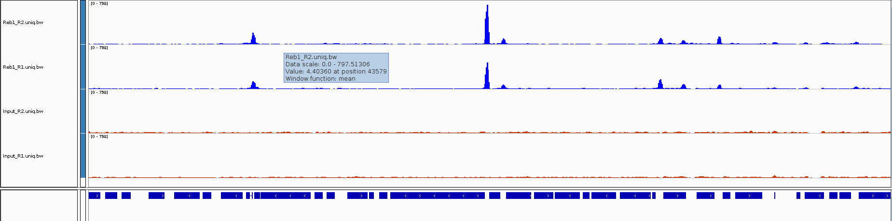

<head>
<script src="https://kit.fontawesome.com/ece750edd7.js" crossorigin="anonymous"></script>
</head>

<br>

### 8. Creating Tracks

### Converting BAM files to bigWig

Visually inspecting data via a genome browser is often the first step in any analysis. Has the sequencing worked as expected? Are there noticeable differences between my samples by eye? BAM files are typically large and contain detailed information for every read, thus they are slow to access and view on a genome browser. If we are only interested in read profiles we can convert our BAM files to graphs of sequencing depth per base. The **wiggle** file format has three columns to represent a genomic interval and a 4th as a score which will represent the number of reads overlapping that region. We will create a compressed version of this format called **bigWig** for use with genome browsers. To do this we are going to use the [deepTools](https://deeptools.readthedocs.io) package which has a lot of useful tools particularly for ChIP-seq analysis. 

The [bamCoverage](https://deeptools.readthedocs.io/en/develop/content/tools/bamCoverage.html) tool in deepTools has many different options for normalising, smoothing and filtering your BAM files before converting to bigWig and the documentation is worth a read.

<div class="blue">
```bash
cat samples.txt | parallel -j 4 "bamCoverage -bs 1 --normalizeUsing BPM -e 200 -b bwa_out/{}/{}.uniq.bam --outFileName bwa_out/{}/{}.uniq.bw"
```
</div>

* **-bs** is the bin size. We set this to 1, but we could smooth our read coverage into larger bins across the genome.
* **--normalizeUsing BPM** is a normalisation strategy akin to TPM in RNA-seq and stands for "bins per million". There are several strategies to choose or we can ignore normalisation.
* **-e 200** extends our reads to 200b as this is the average fragment length. With paired end data the reads would be extended to match the ends of both reads but with single end we must supply a value.

<br>

### 9. Finish your script 

We now have our alignments (BAM) and visualisation files (bigWig) and this is normally a branching point for downstream analyses that quantify and annotate the data.  

Your pipeline.sh script should look something like [this](http://bifx-core.bio.ed.ac.uk/training/ChIP-seq_workshop/pipeline.sh) and we can run everything from start to end in one go.

```bash
mkdir CS_workshop_tmp #Create a temporary directory
cd CS_workshop_tmp #Move into that directory
cp ../pipeline.sh ../samples.txt . #Copy the pipeline and samples file into the new directory
nohup sh pipeline.sh > pipeline.log & #Run the shell script (See Below)
cd .. #Move back to the main directory
```
* The **nohup** command stands for *no hangup* and keeps the process running even if you log out of your command line session. 
* We use the tool **sh** and the name of our script to run our commands through the shell. 
* We then redirect **>** the output to a log file to keep track of any errors.
* We use the **&** to run everything in the background to continue using the terminal.

You can keep track of your pipeline by using **ps** or looking at the log file.

```bash
ps f
tail CS_workshop_tmp/pipeline.log #Shows the end of a file
```

<br>

### Tidy Up! 
Files are large, disk space is expensive, remove any unwanted or temporary files from your folder. We should always keep the raw data (fastq) and our final processed datasets (BAM, bigWig etc) and the script we used to generate them. SAM files are large and should be removed once converted to BAM.

<div class="blue">
```bash 
rm fastq/*trim*fq.gz #Remove trimmed fastq temp files
rm bwa_out/*/*.sam #Remove sam files
```
</div>

<br>

### Integrative Genomics Viewer (IGV)

[IGV](https://www.broadinstitute.org/igv/) (Integrative genomics viewer) is a powerful genome browser from the Broad institute. It is perfect for viewing your sequencing files as loading data is easy, common formats are understood, views are customisable and navigation is quick.

First let's put all of our visualisation files in one folder.

<div class="blue">
```bash
mkdir visualisation
ln -s $PWD/bwa_out/*/*bw visualisation
ln -s $PWD/bwa_out/*/*uniq.bam* visualisation
```
</div>

It is best to download the [desktop app](https://www.broadinstitute.org/igv/) for use on your own machine but if you are using a university managed computer you can access the web app at [https://igv.org/app/](https://igv.org/app/).

Open IGV and set the genome to **sacCer3**, then find your *visualisation* folder online.
In the desktop version you can drag and drop files into IGV. If you are using the webapp you will need to download the files you require and open them using the *tracks* menu. 

Open a BAM file and a corresponding bigWig file into IGV.
Make sure the .bai index file is in the same folder as the BAM.



First, let's navigate the chromosome:

* Use the *+* / *-* zoom bar at the top right
* Drag and highlight an area to zoom on the genome ruler
* Type a position or gene identifier in to the search box
* If we zoom in close enough our BAM file will load and we can investigate alignments of individual reads

Now let's customise our view:

DESKTOP APP

1. Select **Tracks->Fit Data To Window** To automatically set track heights to fill the view
2. Right click on the Refseq genes track and switch between display modes **Collapsed**, **Expanded** and **Squished**. (Use the horizontal panel divider to adjust height)
3. Use the right click menu on the bigwig track name to customise the display. Try the following:
  1. Rename the track
  2. Change the track colour
  3. Change the graph type
  4. Change the windowing function
  5. Adjust the data range
4. Set the scale to **Autoscale**. This automatically sets the Y-axis to the height of the tallest peak in your view.

WEB APP

1. Use the cog on the Ensembl genes track to switch between display modes **Collapsed**, **Expanded** and **Squished**.
2. Customise the bigwig track by trying the following:
  1. Rename the track
  2. Change the track colour
  3. Change the track height
  5. Set a minimum and maximum Y-axis
3. Set the scale to **Autoscale**. This automatically sets the Y-axis to the height of the tallest peak in your view.

<br>

<div class="challenge">
<h2><i class="fas fa-pencil-alt"></i> Challenge:</h2>

One BAM vs bigWig

  *	Why are the coverage profiles different?
  
  *	Which format is faster to view?
  
  * Can you identify **mismatches** in read alignment? 
  
  *	What other information do the BAM files give us?


Now let's load all our bigwig files

  *	Can you identify peaks in the ChIP samples
  
  *	Do you see any peaks that are also present in the Input?

<!--<details>
<summary>
Solution
</summary>
<div class="solution">
<h2><i class="far fa-eye"></i></h2>


</div>
</details> -->

</div>
<br>


<br>

### Other genome browsers 

* [Ensembl](http://www.ensembl.org) and [UCSC](https://genome.ucsc.edu/) websites have online genome browsers where you can view your data alongside published experimental data and genomic annotations in their databases.

<br>

<div class="key-points">
<h2><i class="fas fa-thumbtack"></i>Key Aims:</h2>
##
 * Create tracks from our data
 * Visualise alignments on a genome browser
</div>
<br>
